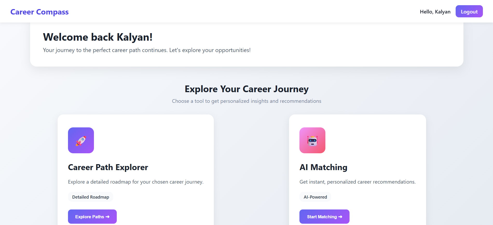

# AI-CareerCompass: A RAG-Driven Conversational Framework for Personalized Career Guidance

**Your career is not chosen by marks — it’s discovered by understanding yourself.**

> AI-CareerCompass is a Retrieval-Augmented Generation (RAG) and conversational AI framework designed to deliver data-driven, personalized career counselling for Indian students after Class 10 and Class 12. It combines structured multi-stage dialogue, weighted scoring, vector retrieval, and LLM reasoning to recommend career paths rooted in real occupational data, not guesswork.

## This is the dashboard:


## Core Vision

Choosing a career after Class 10/12 is one of the highest-impact decisions in a student’s academic life.
But the current situation is broken:

#### Common Problems

- Students choose streams with limited awareness → PCM/PCB/Commerce/Arts confusion
- Guidance based on marks, family pressure, or societal bias
- No understanding of:
   - Personal abilities
   - Future job market trends
   - Actual skills required
- High rate of:
   - Wrong stream selection
   - Course switching
   - Career dissatisfaction
   - Skill-job mismatch

## The Scale of the Problem

Every year, nearly 700,000 Class 10 students in Telangana and Andhra Pradesh alone make stream and career choices with zero structured support.

- 45% → No idea of long-term career consequences
- 30% → Choose wrong streams
- 25% → No tech-driven personalized guidance

- [Source1](https://www.telangana.gov.in/departments/higher-education/)
- [Source2](https://bieap-gov.org/index.html)

The platform provides dynamic career roadmaps that evolve as the student grows (2026 → 2035+).

## Objective

AI-CareerCompass aims to build a trustworthy, explainable, and grounded AI career advisor through:

- RAG-driven career suggestions grounded in O*NET occupational data
- Structured multi-stage dialogue capturing academic, behavioural, and motivational traits
- Weighted scoring to identify high-impact factors (skills, interests, goals)
- Retrieval + reasoning pipeline to minimize hallucination
- Explainable outputs showing why each career is recommended
- Multi-year roadmaps from Class 11 → exams → college → skills → first job

## Dataset: O*NET Occupational Database

O*NET is the world’s most structured, standardized career database containing:

- Job roles
- Required skills
- Tasks & responsibilities
- Knowledge areas
- Work context
- Abilities & interests

#### Using O*NET ensures:

- Grounded recommendations
- Reduced hallucination
- Better skill-career matching
- Realistic roadmaps
- [Source](https://www.onetcenter.org/db_releases.html)

## AI-CareerCompass Architecture

#### Pipeline Overview

- Conversational Intake
    - Structured dialogue captures academic, personal, behavioural, and aspirational data.

- Input Capture
    - Interests, skills, values, constraints, learning style, goals.

- Vectorization
    - Each response → transformed into embeddings and stored in ChromaDB.

- Weighted Scoring Mechanism
    - High-impact attributes weighted heavier
    - Reduces noise from irrelevant/low-impact inputs

- Knowledge Retrieval (RAG)
    - O*NET vectors retrieved semantically
    - Provides skill-role alignment

- LLM Reasoning
    - Groq-powered reasoning models integrate
        - User profile
        - Retrieved knowledge
        - Weighted scoring

- Explainability Layer
    - Clear rationale linking user traits ↔ recommended careers

- Roadmap Generator
    - Stream selection
    - Exam path
    - College recommendations
    - Skills progression
    - Multi-year timeline (2025–2035)

## Weighted Scoring Mechanism
- Not all user inputs should be treated equally.
- Example Weights:

| Attribute           | Weight |
| :------------------ | :-----: |
| Career goals        | High    |
| Interests           | High    |
| Skills              | High    |
| Family constraints  | Medium  |
| Study habits        | Medium  |
| Hobbies             | Low     |
| Generic preferences | Low     |

- This avoids noisy recommendations and produces stable, meaningful career matches.

## Evaluation Using RAGAS

- RAGAS evaluates RAG systems across:
    - Correctness
    - Faithfulness
    - Answer Relevancy
    - Context Precision
    - Context Recall

- Overall System Performance
    - Correctness: 0.95
    - Faithfulness: 0.98
    - Relevancy: 0.96
    - Context Precision: 0.92
    - Context Recall: 0.90


## Tech Stack 

| Layer      | Technology                              |
| :--------- | :--------------------------------------- |
| Backend    | Flask (Python)                          |
| Database   | MongoDB                                 |
| Vector DB  | ChromaDB                                |
| LLM        | Groq API (Llama-3.1 8B/70B)             |
| Embeddings | sentence-transformers/all-MPNet-base-v2 |
| RAG        | LangChain + Chroma                      |
| Auth       | Flask Session + JWT                     |


## Project Structure

```bash
Career-Smart-Path/
├── app/
│   ├── __init__.py
│   ├── routes/
│   │   ├── auth_routes.py
│   │   ├── career_routes.py        # Assessment workflow
│   │   └── dashboard_routes.py     # Result visualization
│   ├── utils/
│   │   ├── db_utils.py
│   │   └── rag_utils.py            # Career matching RAG engine
│   ├── templates/
│   ├── static/
│   └── scripts/
│       └── ingest_data.py          # Load O*NET → Chroma
├── run.py
├── requirements.txt
└── .env.example

```

## Installation Guide

```bash
# 1. Clone
git clone https://github.com/yourusername/Career-Smart-Path.git
cd Career-Smart-Path

# 2. Create env
conda create -n careerpath python=3.11
conda activate careerpath

# 3. Install deps
pip install -r requirements.txt

# 4. Configure env
cp .env.example .env
# Add GROQ_API_KEY + MongoDB URI

# 5. Ingest career dataset (one-time)
python app/scripts/ingest_data.py

# 6. Run app
python run.py
```


## Future Enhancements

- Currently optimized for engineering aspirants.

#### Planned Upgrades:

- Coverage for state-level exams:
    - EAMCET, KCET, MHT-CET, KEAM, WBJEE, etc.
- Detailed roadmaps including:
    - Required subjects & competencies
    - Exam strategy
    - Learning resources
    - College lists
- Non-tech career tracks (Medicine, Design, Law, Government, Arts, Commerce, ITI, Polytechnic)
- Parent/counselor dashboards
- Voice-based assessment (Hindi + regional languages)
- Full mobile app version

## License
This project is licensed under the **MIT License** - see [LICENSE](LICENSE) file.

## Acknowledgements
- O*NET (Occupational Information Network)
- Groq AI LLM
- LangChain & Chroma
- Mentors, teachers, and Team Beacons

---
<div align="center">

*Happy Learning*

</div>


